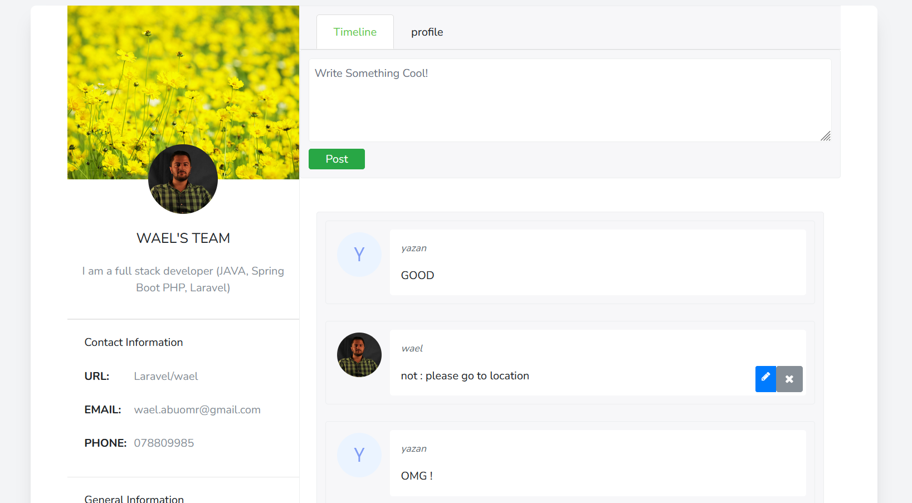

# NotesApp

- Web App and backend for Flutter App
- The idea of this app to post Notes and can share it with others  and can edit , delete the notes
##   Features
- Two factor authentication
- sessions recorder and access to logout from other sessions
- change profile picture 
- Contain translation manager
- Multi garde Auth API
- Authorization with policies with frontend(blade) and backend to edit and delete user's notes
- HTTP filter with middleware
- Mailer to invitation and reset password
- Input validation
## Technologies used
- Laravel 9 , PHP 8.2 
- Mysql DB
- composer 

## Packages and libraries
-   jetstream
-  Laravel translation manager
-  Sanctum
## images
- To edit and show profile info

- To enable two factor auth and Browsers sessions

- The users can see there notes and can edit and delete it , __but__ just can see other users notes without access to edit or delete it

- If the user try to delete or edit note refer to other user , 403 error with actor from polices atomizations

- If the user try to delete or edit note refer to other user , 403 error with actor from __middleware__ atomizations

- register from API

- validation from api

